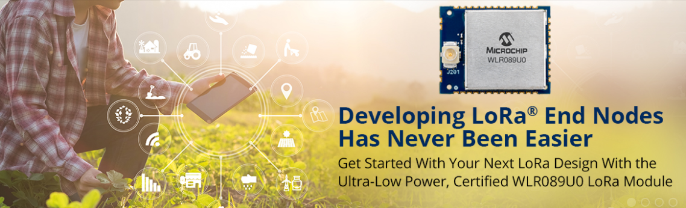
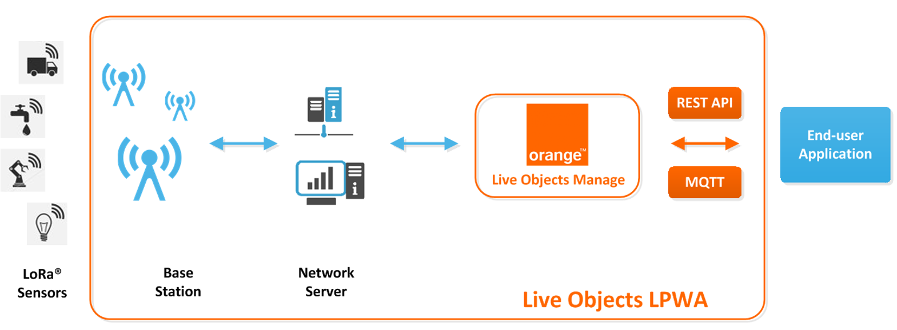
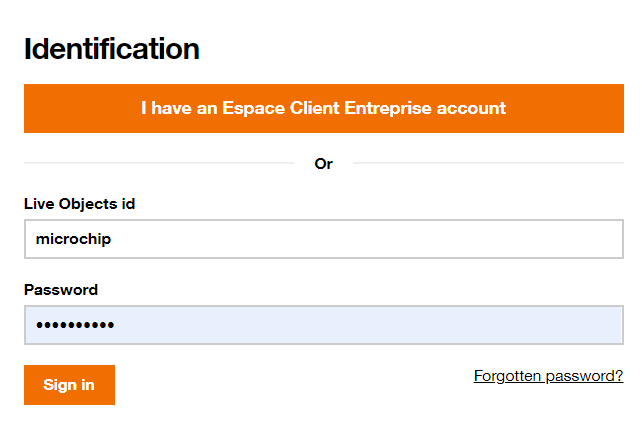
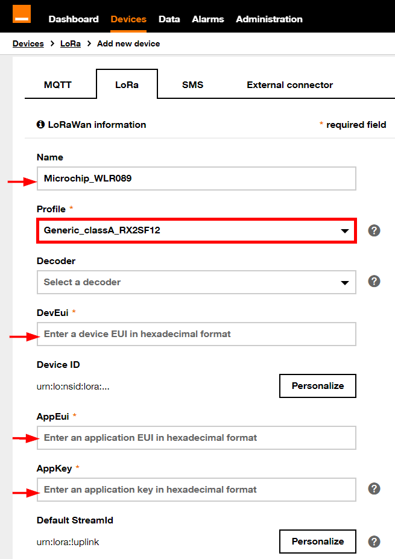
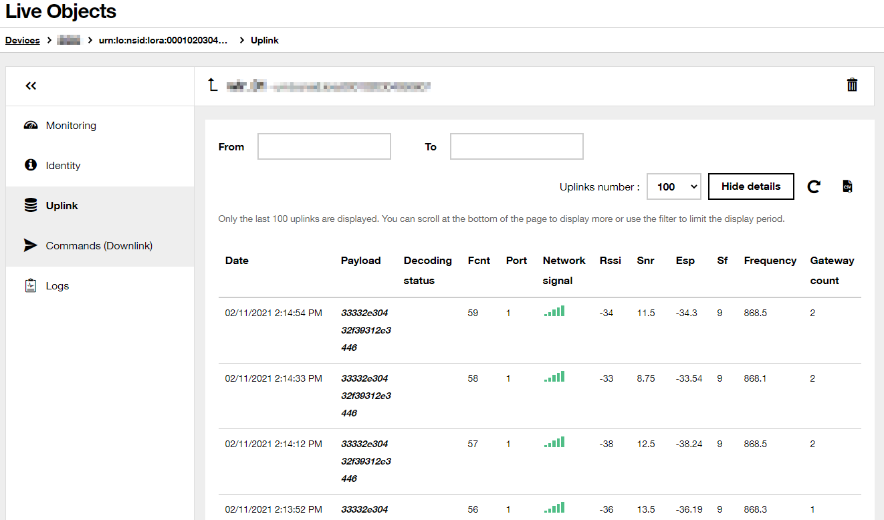

# WLR089U0_LORAWAN_ORANGE
> "Wireless Made Easy!" - Getting Started with WLR089U0 and Orange LoRaWAN Network

Devices: | **WLR089U0**

<p align="left">
<a href="https://www.microchip.com" target="_blank">
</a>
<a href="https://www.microchip.com/wlr089u0" target="_blank">
</a>
</p>

<p align="center">
<a href="https://developer.orange.com/apis/datavenue" target="_blank">
</a>
</p>

## ⚠ Disclaimer

<p><span style="color:red"><b>
Subject to your compliance with these terms, you may use Microchip software and any derivatives exclusively with Microchip products. It is your responsibility to comply with third party license terms applicable to your use of third party software (including open source software) that may accompany Microchip software.<br>
THIS SOFTWARE IS SUPPLIED BY MICROCHIP "AS IS". NO WARRANTIES, WHETHER EXPRESS, IMPLIED OR STATUTORY, APPLY TO THIS SOFTWARE, INCLUDING ANY IMPLIED WARRANTIES OF NON-INFRINGEMENT, MERCHANTABILITY, AND FITNESS FOR A PARTICULAR PURPOSE.<br>
IN NO EVENT WILL MICROCHIP BE LIABLE FOR ANY INDIRECT, SPECIAL, PUNITIVE, INCIDENTAL OR CONSEQUENTIAL LOSS, DAMAGE, COST OR EXPENSE OF ANY KIND WHATSOEVER RELATED TO THE SOFTWARE, HOWEVER CAUSED, EVEN IF MICROCHIP HAS BEEN ADVISED OF THE POSSIBILITY OR THE DAMAGES ARE FORESEEABLE. TO THE FULLEST EXTENT ALLOWED BY LAW, MICROCHIP'S TOTAL LIABILITY ON ALL CLAIMS IN ANY WAY RELATED TO THIS SOFTWARE WILL NOT EXCEED THE AMOUNT OF FEES, IF ANY, THAT YOU HAVE PAID DIRECTLY TO MICROCHIP FOR THIS SOFTWARE.
</span></p></b>

> Interact with your peers about this software in [LoRa Forum](https://www.microchip.com/forums/f512.aspx).

## Abstract

Getting Started with WLR089U0 and Orange LoRaWAN Network.

## Resources

- [WLR089U0 Module page](https://www.microchip.com/wwwproducts/en/WLR089U0)
- [WLR089U0 Module Xplained Pro Evaluation Kit](https://www.microchip.com/EV23M25A)
- [Microchip Studio 7.0 IDE](https://www.microchip.com/en-us/development-tools-tools-and-software/microchip-studio-for-avr-and-sam-devices)

## A la carte

1. [Introduction](#step1)
1. [Hardware Requirements](#step2)
1. [Software Requirements](#step3)
1. [Sample Applications](#step4)
1. [Orange Live Objects](#step5)
1. [LoRa Range Test Demo](#step6)
1. [LoRa Mote Demo](#step7)
1. [LoRa Serial Provisioning Demo](#step8)
1. [LoRa RN Parser Demo](#step9)
1. [Visualize LoRa Messages](#step10)

## Introduction<a name="step1"></a>

Orange has deployed massively a public LoRaWAN network and propose [Live Objects](https://developer.orange.com/apis/datavenue/overview), a software suite for IoT / M2M solution integrators offering a set of tools to facilitate the interconnection between devices and business applications.

For more details, check out :
- [Live Objects Developer Guide](https://liveobjects.orange-business.com/doc/html/lo_manual.html)
- [Orange Coverage](https://www.orange-business.com/fr/reseau-iot)
- [Orange Offers](https://iotmarket.orange.com/connectivity.html)

The purpose of this repo is to provide guidelines to connect [Microchip WLR089U0 Module](https://www.microchip.com/wwwproducts/en/WLR089U0) to Orange LoRaWAN Network and interact with [Live Objects](https://liveobjects.orange-business.com/)

## Hardware Requirements<a name="step2"></a>

Purchase the <a href="https://www.microchip.com/DevelopmentTools/ProductDetails/PartNO/EV23M25A" target="_blank">WLR089U0 Xplained Pro Evaluation Kit</a>
<p align="center">

</p>

Make sure you have a base station nearby and the device is in coverage area.


## Software Requirements<a name="step3"></a>

- Download and install [Microchip Studio 7.0 IDE](https://www.microchip.com/mplab/microchip-studio).
- Open Microchip Studio 7.0 IDE.
- From **Tools - > Extensions and updates**, install Advanced Software Framework (ASFv3) v3.49.1 release or upper release.
- Restart Microchip Studio

- Download and install a serial terminal program like [Tera Term](https://osdn.net/projects/ttssh2/releases/).

- [Clone/Download](https://docs.github.com/en/free-pro-team@latest/github/creating-cloning-and-archiving-repositories/cloning-a-repository) the current repo to get the sample applications.

## Sample Applications<a name="step4"></a>

The following sample applications provided have been tested with **Orange Core Network supporting LoRaWAN 1.0.2**

- LoRa Range Test Demo: [software/WLR089_LoRaWAN_Range_Test_MLS_1_0_P_4](software/)
- LoRa Mote Demo: [software/WLR089_Mote_Application_MLS_1_0_P_4](software/)
- LoRa Serial Provisioning Demo: [software/WLR089_SerialProvisioning_MLS_1_0_P_4](software/)
- LoRa RN Parser Demo: [github.com/MicrochipTech/atsamr34_lorawan_rn_parser](https://github.com/MicrochipTech/atsamr34_lorawan_rn_parser/tree/master/software/WLR089U0_RN_PARSER_MLS_1_0_P_4)


## Orange Live Objects<a name="step5"></a>

Here are the steps to provision your WLR089 end device in order to join the Orange network.

- Access [Live Objects](https://liveobjects.orange-business.com/)
- Enter your login credentials
<p align="center">

</p>

- Add a new device
<p align="center">

</p>

- Register the device with your personal information
  - Name of your device
  - Profile: **Generic_classA_RX2SF12**
  - DevEui (16-hex characters): you can use your own unique device EUI or use the WLR089U0 module/hardware unique EUI provided by the sample applications
  - AppEui / JoinEui (16-hex characters): your own
  - AppKey (32-hex characters): your own (must be unique per device)

<p align="center">

</p>

- Record your keys for provisioning the device later

> You can find some useful videos about Live Objects [here](https://www.youtube.com/channel/UCqiOhIRIpjRvR3Bw0hMLciw).


## LoRa Range Test Demo<a name="step6"></a>

### Provision the device

By default, the application is configured to use WLR089 Hardware EUI as Device EUI with the help of the SYMBOL `MODULE_EUI_READ=1`

The OTAA keys are defined in `conf_app.h`:
```
/* OTAA Join Parameters */

#define DEMO_DEVICE_EUI                         { 0x00, 0x01, 0x02, 0x03, 0x04, 0x05, 0x06, 0x07 }
#define DEMO_APPLICATION_EUI                    { 0x00, 0x01, 0x02, 0x03, 0x04, 0x05, 0x06, 0x07 }
#define DEMO_APPLICATION_KEY                    { 0x00, 0x01, 0x02, 0x03, 0x04, 0x05, 0x06, 0x07,0x00, 0x01, 0x02, 0x03, 0x04, 0x05, 0x06, 0x07 }
```

**Make sure to use the same provisioning keys as configured in Live Objects.**

> For more details, check out the document `SAMR34_GettingStarted_LoRaWAN Range Test` which is part of the project directory.

### Run the demo

- Compile and program the sample application within Microchip Studio
- Open Tera Term (Serial port settings: 115200 8 N 1)
- Select the regional band (**EU868**)
- The application will trigger an unconfirmed message periodically

```
Module EUI = 13ffffc4c4fefeff
Last reset cause: External Reset

***********************************************

Microchip LoRaWAN Stack MLS_SDK_1_0_P_4

Init - Successful

Please select one of the bands listed below
1. EU868
2. NA915
3. AU915
4. AS923
5. JPN923
6. KR920
7. IND865
8. Clear PDS
9. Reset Board
Select Regional Band : 1

****************Join Parameters****************

DevEUI : 0xXXXXXXXXXXXXXXXX

AppEUI : 0xXXXXXXXXXXXXXXXX

AppKey : 0xXXXXXXXXXXXXXXXXXXXXXXXXXXXXXXXX

TxPower Index     = 00
Current Data rate = DR3
ADR               = OFF

Confirmed Retries : 04

Join Request Sent for EU868

Joining Successful
Joined on Channel 1

DevAddr: 0x1fb4dd6f

*************Application Configuration*************

DevType           : CLASS A

ActivationType    : OTAA

Transmission Type : UNCONFIRMED

FPort             : 1

TxPower Index     : 00

Confirmed Retries : 04

***************************************************
***************************************************
Temperature: 33.0ø C  / 91.4ø F

Tx Data Sent
Transmission Success
Active Channel 0
Active TxPower Index = 00
Active Data rate = DR3
***************************************************

wakeup from sleep_ok 14135 ms
***************************************************
Temperature: 33.0ø C  / 91.4ø F

Tx Data Sent
Transmission Success
Active Channel 0
Active TxPower Index = 00
Active Data rate = DR3
***************************************************
```


## LoRa Mote Demo<a name="step7"></a>

### Provision the device

By default, the application is configured to use WLR089 Hardware EUI as Device EUI with the help of the SYMBOL `MODULE_EUI_READ=1`

The OTAA keys are defined in `conf_app.h`:
```
/* OTAA Join Parameters */

#define DEMO_DEVICE_EUI                         { 0x00, 0x01, 0x02, 0x03, 0x04, 0x05, 0x06, 0x07 }
#define DEMO_APPLICATION_EUI                    { 0x00, 0x01, 0x02, 0x03, 0x04, 0x05, 0x06, 0x07 }
#define DEMO_APPLICATION_KEY                    { 0x00, 0x01, 0x02, 0x03, 0x04, 0x05, 0x06, 0x07,0x00, 0x01, 0x02, 0x03, 0x04, 0x05, 0x06, 0x07 }
```

**Make sure to use the same provisioning keys as configured in Live Objects.**

### Run the demo

- Compile and program the sample application within Microchip Studio
- Open Tera Term (Serial port settings: 115200 8 N 1)
- Select **Demo application**

```
Module EUI = 13ffffc4c4fefeff
Last reset cause: External Reset


*******************************************************

Microchip LoRaWAN Stack MLS_SDK_1_0_P_4

Init - Successful
1. Demo application
2. Certification application

 Select Application :

```

 - Select the regional band (**EU868**)

```
Please select one of the band given below
1. EU868
2. NA915
3. AU915
4. AS923
5. JPN923
6. KR920
7. IND865
8. Clear PDS
9. Reset Board
Select Regional Band : 
```

- The application is printing the parameters and configuration of the end-device

```
********************Join Parameters********************

DevEUI : 0xXXXXXXXXXXXXXXXX

AppEUI : 0xXXXXXXXXXXXXXXXX

AppKey : 0xXXXXXXXXXXXXXXXXXXXXXXXXXXXXXXXX

Join Request Sent for EU868

Joining Successful

DevAddr: 0x1fb4dd6f

***************Application Configuration***************

DevType : CLASS A

ActivationType : OTAA

Transmission Type - UNCONFIRMED

FPort - 1

*******************************************************

*******************************************************

1. Send Join Request
2. Send Data
3. Sleep
4. Main Menu

Enter your choice:
```

- Select **Send Join Request**

- After received `Joining Successful`, you can send unconfirmed message

```
1. Send Join Request
2. Send Data
3. Sleep
4. Main Menu

Enter your choice: 2

Temperature:35.4ø C/95.7ø F

Tx Data Sent
Transmission Success
```

> The regional parameters such as default Data Rate can be set in `conf_regparams.h`\
E.g. for `EU_BAND`:

```
#if (EU_BAND == 1)

#define MAC_DEF_TX_POWER_EU					(1)
#define MAC_DEF_TX_CURRENT_DATARATE_EU		(DR0)
#define MAC_DATARATE_MIN_EU					(DR7)
#define MAC_DATARATE_MAX_EU					(DR0)
#define FEATURES_SUPPORTED_EU               (DUTY_CYCLE_SUPPORT|JOIN_BACKOFF_SUPPORT)
#endif
```

## LoRa Serial Provisioning Demo<a name="step8"></a>

### Run the demo

- Compile and program the sample application within Microchip Studio
- Open Tera Term (Serial port settings: 115200 8 N 1)
- Select **Over the Air Activation**

```
Last reset cause: External Reset


*******************************************************

Microchip LoRaWAN Stack MLS_SDK_1_0_P_4

Module EUI = 13ffc4feff19276a
Init - Successful

---Join Type Selection---
1. Over The Air Activation(OTAA)
2. Activation By Personalization(ABP)

Enter your choice:
```

- Provision the device manually (**Make sure to use the same provisioning keys as configured in Live Objects**) without pressing [ENTER] key to validate the entry
- Enter the DevEUI

```
Enter Device EUI(hex 0-F): XXXXXXXXXXXXXXXX
```
- Enter the AppEUI/JoinEUI

```
Enter Join EUI(hex 0-F):
```

- Enter the AppKey

```
Enter Application Key(hex 0-F):
```

- Confirm the configuration to move forward

```
1. Confirm App Configuration Selection
2. Modify Configuration
Enter your choice:
```

- Select **Demo application**

```
--Choose Application Type--
1. Demo application
```

- Selection the regional band (**EU868**)

```
Please select one of the band given below
1. EU868
2. NA915
3. AU915
4. AS923
5. JPN923
6. KR920
7. IND865
8. Clear PDS
9. Reset Board
Select Regional Band :
```

- After received `Joining Successful`, you can send unconfirmed message

```
1. Send Join Request
2. Send Data
3. Sleep
4. Select Band

Enter your choice: 2

Temperature:35.1ø C/95.1ø F

Tx Data Sent
Transmission Success
```

## LoRa RN Parser Demo<a name="step9"></a>

### Run the demo

- Compile and program the sample application within Microchip Studio
- Open Tera Term (Serial port settings: 115200 8 N 1)
- Initialize the module and the LoRaWAN stack with the following commands

```
> sys factoryRESET
> mac reset 868
```

- Provision the device for OTAA with your own keys (**Make sure to use the same provisioning keys as configured in Live Objects**)

```
> mac set deveui XXXXXXXXXXXXXXXX
> mac set joineui XXXXXXXXXXXXXXXX
> mac set appkey XXXXXXXXXXXXXXXXXXXXXXXXXXXXXXXX
```

- After getting `accepted`, you can send uplink message to the network
- Transmit unconfirmed message on port 1

```
> mac tx uncnf 1 AABBCCDDEEFF
ok
mac_tx_ok
```

- Transmit confirmed message on port 2

```
> mac tx cnf 2 0011223344556688
ok
mac_tx_ok
```

> For more details on this demo, check out [here](https://github.com/MicrochipTech/atsamr34_lorawan_rn_parser)

## Visualize LoRa Messages<a name="step10"></a>

- Observe the uplink messages received with Live Objects

<p align="center">

</p>